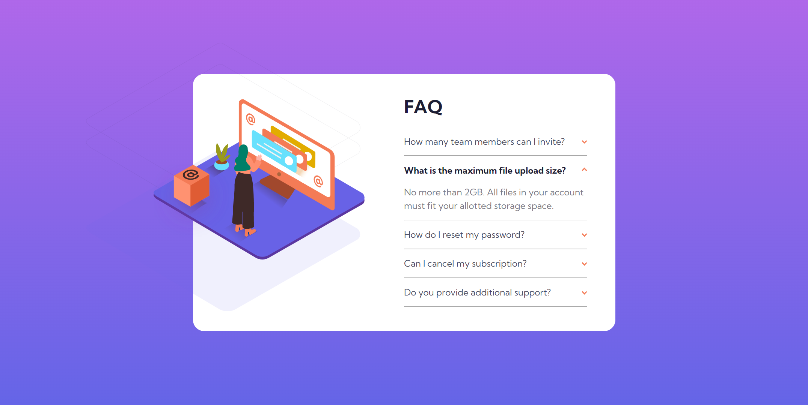

# Frontend Mentor - FAQ accordion card solution

This is my personal solution to the [FAQ accordion card challenge on Frontend Mentor](https://www.frontendmentor.io/challenges/faq-accordion-card-XlyjD0Oam). Frontend Mentor challenges help you improve your coding skills by building realistic projects, they provide you with a jpg of what the design or component should look like at each viewport width and then you write the code to make the design a functional website.

## Project Overview and Reflections

Working on this project gave me a chance to delve into the `
` and `
` HTML elements, exploring their semantic use in creating accordion components. The hands-on experience of getting to experiment with these elements was really fun, and I foresee their applicability in numerous future web development builds that I will work on.

At a glance, the user interface may appear straightforward, yet the complexity lies in integrating multiple images for what may apear to the end user as a single illustration, to achieve this demanded meticulous positioning and layering, an excellent exercise in applying my CSS positioning skills in a practical scenario.

Completing this project was a great experience. It has equipped me with useful insights into accordion construction and the practical use of the `
` and `
` tags, knowledge that I am eager to apply to current personal projects.

## Table of contents

  - [Screenshot](#screenshot)
  - [Links](#links)
  - [Built with](#built-with)
  - [Author](#author)

### Screenshot
##### Desktop View - Below (1440px viewport width)

##### Mobile View - Below (375px viewport width)

### Links

- Solution URL: [https://github.com/jacksen30/faq-accordion-component]
- Live Site URL: [https://faq-accordion-jn.netlify.app/]

### Built with

- Semantic HTML5 markup
- CSS 3
- CSS FLEX layout

## Author

- Website - [Jacksen Nillson](https://devbyjacksen.com/)
- Frontend Mentor - [@jacksen30](https://www.frontendmentor.io/profile/jacksen30)

